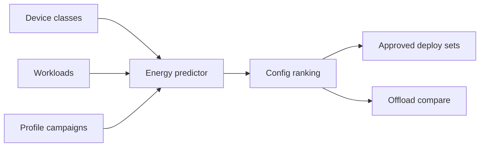

# JouleSight

**Source:** `ai-in-iot/1902.11119v1/`
**Domain:** `ai-iot`
**One-liner:** Predicts energy, latency, and accuracy trade-offs for image-classification workloads on constrained IoT edge boards so operators pick resolution, algorithm, and phase before battery or harvest budgets fail.
**Wedge:** Battery- or solar-powered vision edges (flood debris cameras, motion-triggered security, assistive obstacle cameras) where wrong model/resolution choices burn joules and miss duty cycles.
**Positioning:** Edge vision energy planner. Cloud offload is often worse than local inference when transmission energy dominates; the paper shows linear ties between model complexity, resolution, and dataset size vs energy, and that random-forest predictors can forecast consumption (R² ≈ 0.95 / 0.79 on held-out sets). JouleSight productizes that profiling loop into device catalogs, workload specs, measured profiles, and deployable predictions.

## Market research synthesis

### Thesis from source

Gartner-scale IoT growth pushed processing toward the edge (e.g., Raspberry Pi–class boards) to cut latency, connectivity risk, and cloud energy (cloud TWh growth cited as a carbon concern). Mission-critical vision—autonomous vehicles, surgical devices, security cameras, rescue drones, flood debris classification—needs local image classification, but DNNs (AlexNet/GoogLeNet/ResNet) demand billions of MACs and memory traffic that conflict with duty-cycled, battery/harvest devices.

Experiments relate energy to dataset size, image resolution, algorithm type/phase, and hardware. Strong positive linear relationships appear between model complexity, resolution, and dataset size vs energy. Lower resolution can roughly halve operations (e.g., ResNet-50 224→160) while preserving accuracy from higher-resolution training. Random forests outperform linear regression and Gaussian processes for energy prediction across validation sets. Static profiling is slow and needs programmable power meters; a predictor lets teams compare configurations before field deploy, with future work pointing to dynamic algorithm switching from live model feedback.

### Buyer & economic model

- **Primary buyer:** IoT product / edge ML lead for vision fleets (utilities flood ops, security OEMs, assistive-device makers).
- **Users:** embedded ML engineers, power/thermal engineers, site reliability for camera fleets, sustainability officers.
- **Budget owner / value metric:** device BOM + field OPEX. Metrics: joules/inference, duty-cycle success rate, false cloud-offload rate, time-to-select deploy config.
- **Competing status quo:** bench power meters and spreadsheets; pick largest model that “fits”; always offload to cloud.

### Domain constraints

- **Regulatory / trust / safety:** safety-critical vision cannot silently drop accuracy for energy; predictions must expose accuracy bounds.
- **Data sensitivity:** site images (flood, security) stay on-device; profiles use aggregates, not raw frames.
- **Change-management realities:** field techs need a shortlist of approved configs, not research notebooks.

## Business requirements

- BR-1: Every edge device class must publish measured power envelope and supported algorithm/phase combinations.
- BR-2: Workloads must declare resolution, dataset cardinality, accuracy floor, and latency SLA.
- BR-3: Energy predictions must cite model features (complexity, resolution, size, hardware) and confidence.
- BR-4: Configurations failing accuracy floor cannot be recommended even if lowest energy.
- BR-5: Cloud-offload energy estimates must be comparable against on-device inference for the same task.
- BR-6: Duty-cycle devices must model sleep/wake so predictions include idle vs active joules.
- BR-7: Profile campaigns must be auditable (who measured, meter, ambient conditions).
- BR-8: Operators can freeze an approved config set per site and require change control to alter it.
- BR-9: Harvest/solar sites must flag predictions that exceed budgeted daily energy.
- BR-10: Commercial packaging prices by active device classes and prediction volume.
- BR-11: Validation datasets with unseen traits must be tracked so R² drift triggers retrain of the predictor.
- BR-12: Raw site imagery is never required to run a prediction—only workload metadata.

## User stories

Canonical user stories live in sibling [USER_STORIES.md](USER_STORIES.md).

## System design

### Overview

JouleSight catalogs device classes, defines vision workloads, stores lab/field energy profiles, trains or hosts predictors, and returns ranked deploy configs with energy/latency/accuracy envelopes—optionally comparing cloud offload.

### Actors & boundaries

- **Actors:** ML engineers, power engineers, fleet ops, sustainability, lab meters, device OTA systems.
- **Trust boundary:** JouleSight does not run inference on customer images; it plans and predicts. Devices remain SoR for models.
- **Human-in-the-loop points:** approve config sets, accept profiles into training corpus, override with documented exception.

### Core capabilities

1. **Device class registry** — SBC/SoC power envelopes.
2. **Workload specs** — resolution, dataset, SLAs.
3. **Profile campaigns** — measured joules by algorithm/phase.
4. **Energy prediction** — RF (or successor) forecasts.
5. **Config ranking** — constrained optimization vs accuracy/latency.
6. **Offload comparison** — on-device vs cloud transmit energy.
7. **Approved deploy sets** — change-controlled site configs.
8. **Predictor health** — validation R² / drift alerts.

### Conceptual data

- **Primary entities:** DeviceClass, Workload, ProfileCampaign, EnergySample, Prediction, DeployConfig, OffloadEstimate, PredictorModel.
- **Critical events:** profile ingested, prediction issued, config approved, budget breach, predictor drift.
- **Retention / audit needs:** profiles and approvals retained for product lifetime; raw images not stored.

### Integrations (conceptual)

- **Systems of record:** device inventory, OTA/model registry, power meters.
- **Upstream signals:** bench measurements, hardware SKUs, accuracy eval harnesses.
- **Downstream actions:** OTA pin to config, alerts to ops, sustainability dashboards.

### High-level architecture

### Success metrics

- **Leading:** % workloads with predictions before deploy; profile coverage per device class.
- **Lagging:** field energy vs predicted error; battery/harvest failures attributable to model choice.

## OpenAPI skeleton

Canonical HTTP surface lives in sibling `openapi.yaml`. Summarize here:

- **Base path:** `/v1/...`
- **Auth:** API key and/or Bearer JWT (operator)
- **Resource groups:** Devices, Workloads, Profiles, Predictions, Deploys
