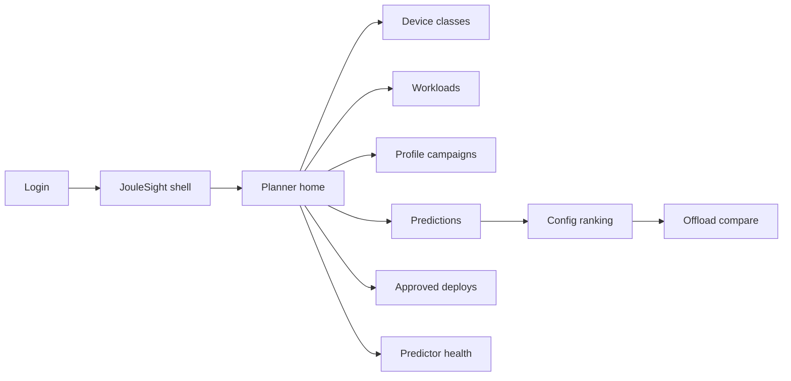
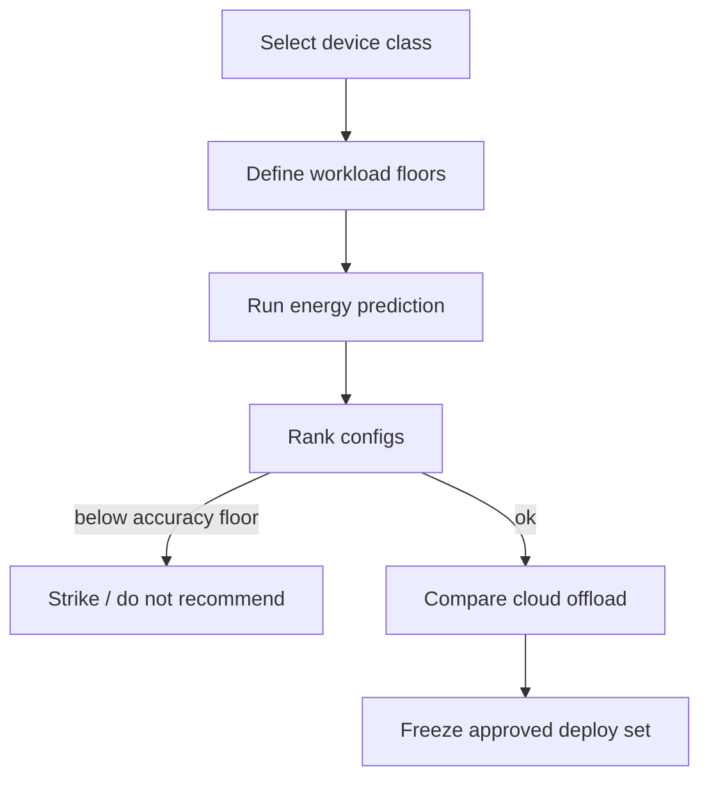

# JouleSight — Web app

**Product:** [PRODUCT.md](./PRODUCT.md)
**Primary surface:** Edge vision energy planner (config ranking before field deploy)
**Secondary surfaces:** Approved deploy-set read-only for field techs; sustainability joules/inference export
**Design thesis:** JouleSight is a sight glass on joules — operators see energy, latency, and accuracy trade-offs before a battery or harvest budget fails. The UI metaphor is an engineering sight glass and ranked shortlist, not a model zoo: resolution and algorithm dials move predicted joules; configs below the accuracy floor are struck through, never “recommended.” Visual language is warm amber energy marks on cool steel-blue ground (instrument panel, not solar-marketing greenwash). The JouleSight wordmark anchors every prediction and deploy freeze so fleets know which planner approved the config.

## UX research synthesis

### Category peers (best-in-class)

- **Edge Impulse EON Tuner / deployment targets:** Explicit RAM/latency/flash targets beside accuracy. Steal: constrained ranking with device budget as first-class; reject hobby “impulse” branding for industrial flood/security fleets.
- **Qualcomm AI Hub / Arm ML Embedded Evaluation Kit:** On-device performance reports for model+resolution variants. Steal: algorithm/phase matrices per hardware class; reject opaque “optimized” badges without joule citations.
- **MLPerf Inference / Tiny reporting:** Comparable latency/energy tables across systems. Steal: auditable profile methodology and ambient conditions; reject leaderboard gamification that ignores accuracy floors.
- **Monsoon / Joulescope bench software:** Meter-tied measurement campaigns. Steal: profile campaigns linked to meter IDs and operators; reject spreadsheet-only handoff as the product end-state.

### Patterns to adopt / reject

- **Adopt:** Device-class power envelopes; workload accuracy floor + latency SLA; RF-style predictions with confidence; on-device vs cloud-offload joule compare; duty-cycle sleep/wake; harvest budget breach flags; change-controlled approved configs; no raw imagery required.
- **Reject:** Lowest-energy recommendation that fails accuracy; “cloud is always cheaper” default; research-notebook only UX; editable joule numbers; purple AI optimizer glow; requiring site images to plan.

### Trust, density, and workflow constraints from PRODUCT.md

Safety-critical vision cannot trade away accuracy silently (BR-4). Predictions must cite features and confidence (BR-3). Profiles are auditable with meter and ambient metadata (BR-7). Duty-cycle and harvest budgets must be modeled (BR-6, BR-9). Site imagery never required (BR-12). Fleet ops need frozen shortlists (BR-8). Density favors ranked tables with struck invalid rows over vanity carbon dashboards.

## Information architecture

### Nav model

### Roles → default home

| Role | Default home | Why |
|------|--------------|-----|
| Embedded ML engineer | Planner home — ranked configs | Pick cheapest above accuracy floor |
| Power / thermal engineer | Profile campaigns | Meter-tied reproducibility (BR-7) |
| Fleet operator | Approved deploys | Tech shortlist + change control (BR-8) |
| Sustainability officer | Fleet joules trends | Edge vs cloud carbon signal |
| Admin | Device class API scopes | Partner isolation (BR-10) |

### Cross-links to OpenAPI resources

| Nav area | OpenAPI tags / resources |
|----------|---------------------------|
| Device classes | Devices |
| Workload specs | Workloads |
| Profile campaigns | Profiles |
| Predictions / ranking | Predictions |
| Approved deploy sets | Deploys |

## Screen inventory

### Planner home

- **Purpose:** Answer “which resolution/algorithm still clears accuracy before the battery dies?” in one composition.
- **Entry:** Post-login for ML engineer.
- **Layout regions:** Brand + fleet switcher; joules strip (median predicted J/inference, harvest breaches, offload-worse count); recent predictions; configs awaiting approval; predictor drift alert.
- **Primary actions:** New prediction; open harvest breach; freeze deploy set.
- **Empty / loading / error:** Empty = register device class + workload; loading = skeleton strip; error = retry with request id.
- **BR / story ties:** BR-3, BR-9; engineer stories.

### Device class registry

- **Purpose:** Publish measured power envelopes and supported algorithm/phase combinations per board class.
- **Entry:** Nav → Devices.
- **Layout regions:** Device table (SBC/SoC, envelope, supported phases); detail with sleep/active current; algorithm matrix.
- **Primary actions:** Add device class; attach envelope; mark phases supported.
- **Empty / loading / error:** Empty = import Pi-class template; incomplete envelope = cannot predict.
- **BR / story ties:** BR-1, BR-6.

### Workload specs

- **Purpose:** Declare resolution options, dataset cardinality, accuracy floor, latency SLA — without uploading site images.
- **Entry:** Nav → Workloads.
- **Layout regions:** Workload list; editor with accuracy floor (hard constraint); latency SLA; candidate resolutions; mission tags (flood, security, assistive).
- **Primary actions:** Create workload; set floor; clone for site variant.
- **Empty / loading / error:** Missing floor = block prediction.
- **BR / story ties:** BR-2, BR-12.

### Profile campaigns

- **Purpose:** Capture lab/field measured joules by algorithm/phase with audit metadata.
- **Entry:** Power engineer default; Profiles nav.
- **Layout regions:** Campaign table; meter id; operator; ambient conditions; sample grid by algorithm/phase/resolution; accept-into-predictor control.
- **Primary actions:** Start campaign; ingest samples; accept/reject into corpus.
- **Empty / loading / error:** Empty = connect meter workflow; incomplete ambient = warn.
- **BR / story ties:** BR-7, BR-11.

### Prediction and config ranking

- **Purpose:** Forecast energy/latency/accuracy envelopes and rank configs; strike those below accuracy floor.
- **Entry:** Home CTA; Predictions.
- **Layout regions:** Workload + device pickers; ranked table (J/inference, latency, accuracy bound, confidence); struck rows for floor fails; feature citation panel (complexity, resolution, size, hardware).
- **Primary actions:** Run prediction; compare offload; promote to approve candidate.
- **Empty / loading / error:** Low confidence = amber; predictor drift = block with retrain CTA.
- **BR / story ties:** BR-3, BR-4; exception path story.

### Offload comparison

- **Purpose:** Compare on-device inference joules vs cloud transmit+remote compute for the same task.
- **Entry:** From ranking row; dedicated compare.
- **Layout regions:** Side-by-side joule stacks; connectivity assumptions; “cloud worse” callout when transmission dominates.
- **Primary actions:** Pin comparison to workload notes; export for leadership.
- **Empty / loading / error:** Missing radio model = estimate with disclosed assumptions.
- **BR / story ties:** BR-5; engineer cloud-assumption story.

### Duty-cycle and harvest budget

- **Purpose:** Model sleep/wake and daily harvest so predictions include idle joules and budget breaches.
- **Entry:** From prediction advanced; site energy settings.
- **Layout regions:** Sleep current; wake schedule; solar/harvest daily budget; breach flag on configs.
- **Primary actions:** Save site energy model; re-rank with budget filter.
- **Empty / loading / error:** No harvest model = duty-cycle-only mode labeled clearly.
- **BR / story ties:** BR-6, BR-9; fleet operator stories.

### Approved deploy sets

- **Purpose:** Freeze shortlisted configs per site with change control.
- **Entry:** Fleet operator default; Deploys nav.
- **Layout regions:** Site → approved configs; change-request log; OTA pin status.
- **Primary actions:** Approve set; request change; revoke config.
- **Empty / loading / error:** Empty = promote from ranking; unapproved flash attempt = blocked message for tech view.
- **BR / story ties:** BR-8.

### Predictor health

- **Purpose:** Track validation R² and drift on unseen traits so predictions stay trustworthy.
- **Entry:** Admin/ML ops; home drift alert.
- **Layout regions:** R² history; held-out trait coverage; retrain queue; last accepted profile corpus version.
- **Primary actions:** Trigger retrain; pause predictions on drift.
- **Empty / loading / error:** Drift over threshold = coral banner on all prediction screens.
- **BR / story ties:** BR-11.

### Sustainability trends (read-only)

- **Purpose:** Show fleet joules/inference and edge-vs-cloud avoided energy.
- **Entry:** Sustainability role.
- **Layout regions:** Trend charts; site rollups; export.
- **Primary actions:** Export period report.
- **Empty / loading / error:** Empty = need approved deploys with predictions.
- **BR / story ties:** Sustainability officer story.

## Key flows

1. **Plan before deploy** — pick device class + workload → run prediction → rank configs → strike below floor → optional offload compare → approve deploy set; failure: drift pause or missing envelope.

2. **Profile to predictor** — meter campaign → audit ambient → accept samples → improve predictor → R² update.

3. **Harvest breach prevention** — site harvest budget set → ranking flags over-budget configs → operator picks alternate resolution.

4. **Change-controlled flash** — tech sees approved shortlist only → change request if new model needed → ML re-predicts → ops approves.

5. **Cloud myth check** — same workload → offload estimate → leadership export when transmission energy dominates.

## Design system

### Tokens (CSS variables)

- `--color-ink: #E9EEF2` — primary text
- `--color-steel-950: #0A1016` — app ground
- `--color-steel-900: #141C26` — panels
- `--color-joule: #E6A23C` — energy marks / predicted joules
- `--color-joule-dim: #8A5A14` — joule on dark
- `--color-sight: #4A8FA8` — instrument blue secondary
- `--color-pass: #5BAF7D` — within budget / above floor
- `--color-strike: #C45C4E` — below floor / harvest breach
- `--color-amber: #D4A017` — low confidence / drift
- `--color-brand: #F0C57A` — JouleSight wordmark accent
- `--font-display: "IBM Plex Sans", sans-serif` — titles and joule numerals
- `--font-mono: "IBM Plex Mono", monospace` — meter ids, J/inference, R²
- `--font-body: "IBM Plex Sans", sans-serif`
- `--space-1`…`--space-8`: 4px scale
- `--radius-sm: 4px`; `--radius-md: 8px` — instrument, not consumer soft
- `--motion-sight: 200ms ease-out` — ranking row settle
- `--motion-breach: 220ms ease-in-out` — harvest breach pulse
- Atmosphere: subtle horizontal instrument grid; amber sight-glass glow on energy columns; no stock solar-farm hero photos in console.

### Typography & brand

- Display/mono for joule figures and confidence; body for workload narrative.
- Wordmark on prediction and deploy freeze screens.
- Login: brand hero; headline (“See the joules before you flash”); one CTA — no carbon-stat carnival.

### Do / don’t

- **Do:** Strike below-floor configs; cite prediction features; show sleep joules; compare offload honestly; freeze shortlists for techs.
- **Don’t:** Recommend unsafe low-energy picks; require raw images; purple optimizer panels; editable meter samples after accept; rainbow KPI tiles.

### Accessibility & domain trust cues

- Struck rows use text “Below accuracy floor” plus icon, not colour alone.
- Live regions announce harvest breach and predictor pause.
- Focus: device → workload → prediction → approve.
- Profile audit fields required before corpus accept.

## Component patterns

- **JouleRankRow** — ranked config with J/inference, latency, accuracy bound, confidence.
- **AccuracyFloorStrike** — non-recommendable row treatment.
- **OffloadCompareStack** — on-device vs transmit+cloud joules.
- **HarvestBudgetFlag** — daily energy breach chip.
- **ProfileMeterAudit** — meter id, operator, ambient.
- **DeployFreezeSet** — change-controlled site shortlist.
- **PredictorR2Badge** — health / drift state.
- **DutyCycleModel** — sleep/wake joule breakdown.

## Out of scope for v1 web

- On-device inference runtime; automatic dynamic algorithm switching in production firmware (planner only); raw image labeling tools; full carbon accounting ERP; consumer camera mobile app; white-label OEM storefront.
